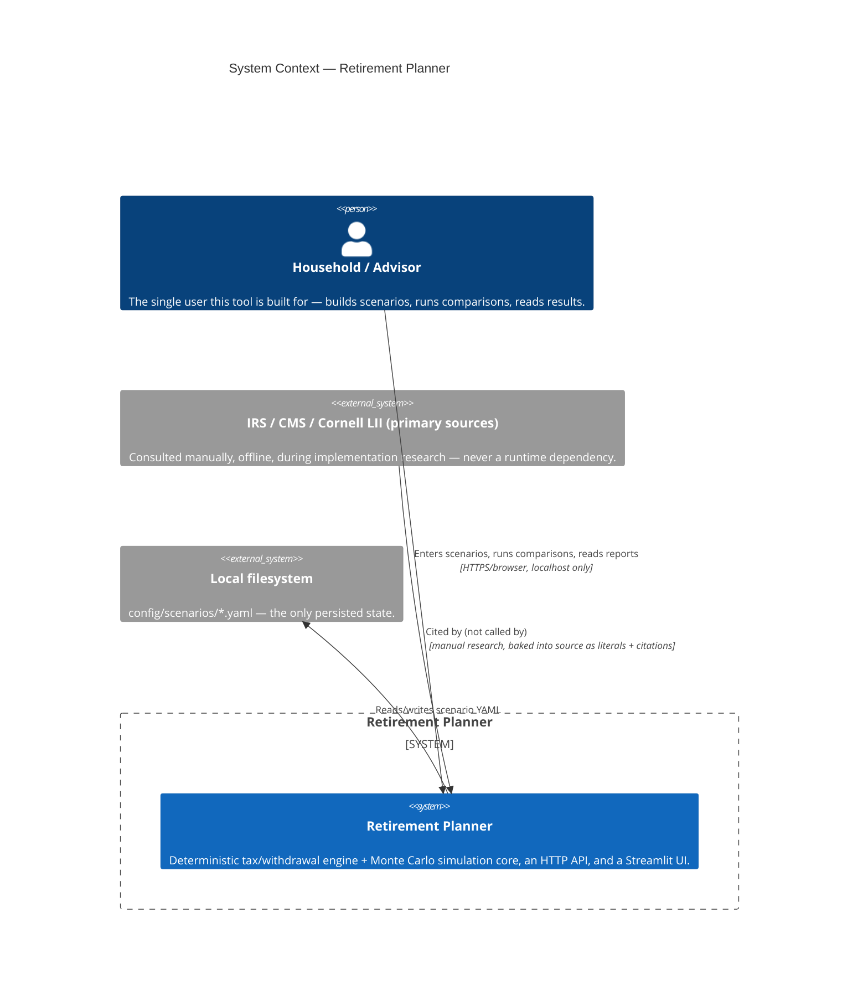
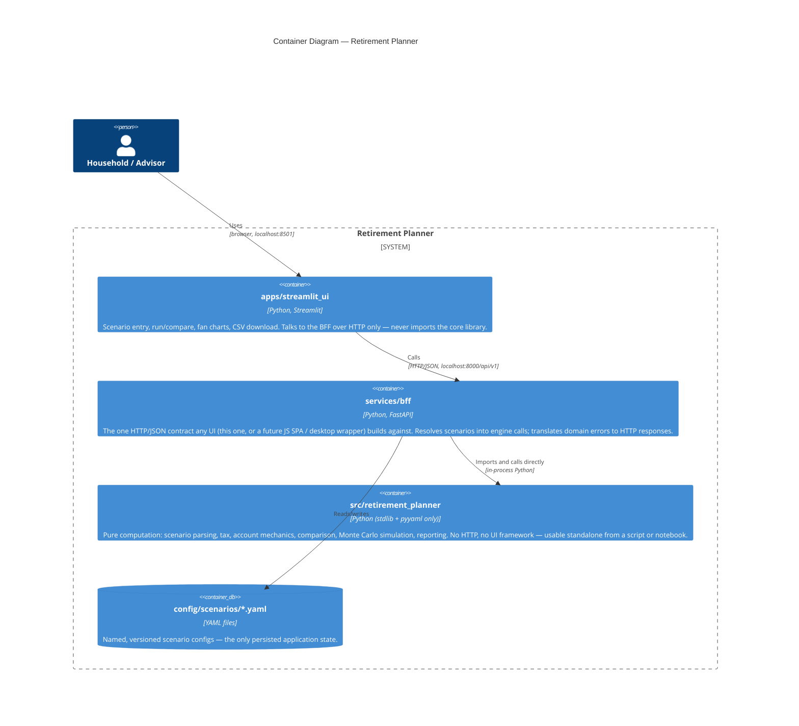
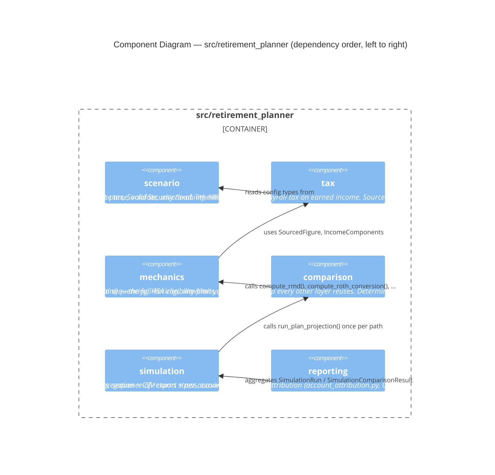
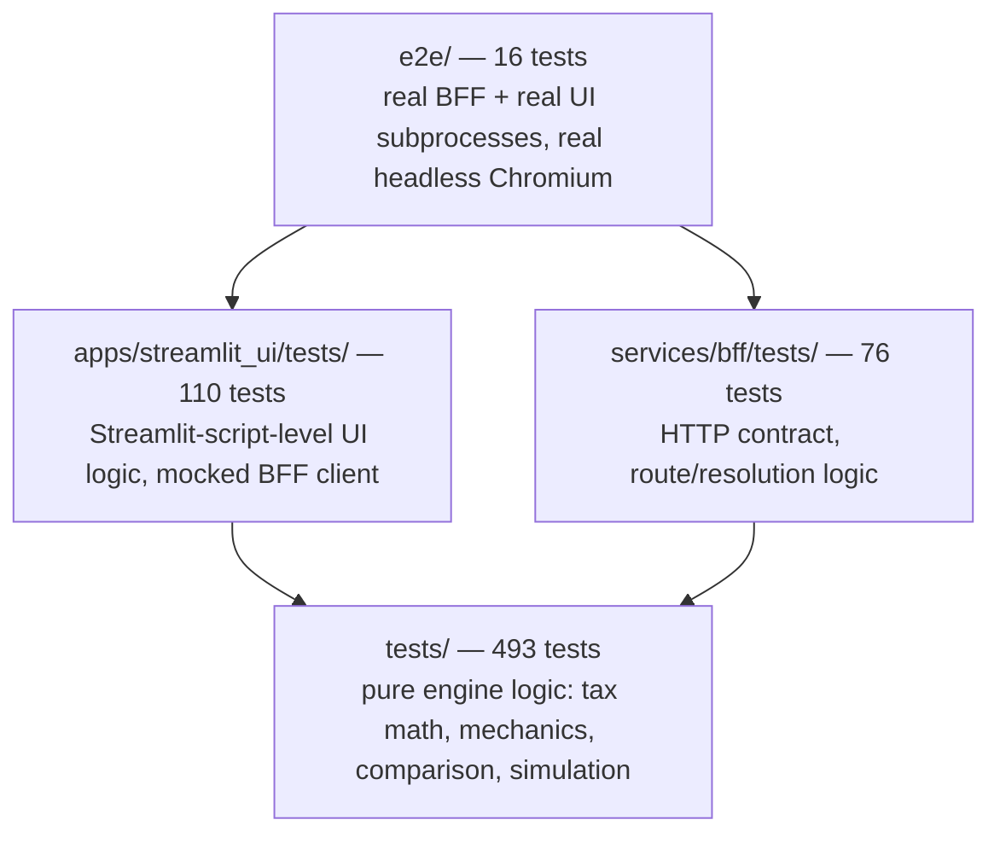

# Solution Architecture: Retirement Planner

**Status**: Living document — reflects the codebase as of `specs/001`–`014`

> **Keeping this document current**: Every diagram and table here
> describes what's actually in the repo today, not an aspiration. A
> feature that adds a new package, a new BFF route, a new UI page, a new
> core subpackage, or changes a dependency boundary **must** update the
> relevant diagram/table here in the same change — the same discipline
> `docs/BRD.md` asks for its own content. If a diagram and the code
> disagree, the code is right and this document is stale; fix the
> document, don't trust it blindly.

---

## 1. System context

Who and what this system talks to. It is a **single-user, offline-first**
tool — there is no multi-tenant server, no third-party API call at run
time, and no account aggregation. Every arrow below is either a human at
a browser, or a local process talking to another local process.



**Deployment posture**: the BFF binds to `127.0.0.1` only (never a public
interface); the Streamlit UI talks to that BFF over `localhost` HTTP.
Nothing in this system is designed to be, or should be, exposed to the
public internet as-is.

## 2. Containers

Three independently-deployable packages, each with its own
`pyproject.toml` and its own dependency set, plus a fourth
test-only container (`e2e/`) that drives the other three together. Every
package boundary is enforced by a test (`test_dependency_containment.py`
in each of the two outer packages), not just convention.



| Container | Language/framework | Owns | Never depends on |
|---|---|---|---|
| `apps/streamlit_ui` | Python 3.11+, Streamlit, `httpx`, `plotly` | Data entry forms, charts, CSV download UI | `retirement_planner` (no direct import — HTTP only) |
| `services/bff` | Python 3.11+, FastAPI, `uvicorn` | Route handlers, request/response schemas (Pydantic), scenario resolution, HTTP error translation | Any UI-specific rendering concern |
| `src/retirement_planner` | Python 3.11+, `pyyaml` only | All domain logic: tax, mechanics, comparison, simulation, reporting | `fastapi`, `streamlit`, or any HTTP/UI concern |
| `e2e/` (test-only) | Python, Playwright | Launches real `bff` + `ui` subprocesses, drives them via headless Chromium | Not a deployable container — CI/local verification only |

## 3. Components — the core library

`src/retirement_planner/` is six subpackages, each depending only on the
ones before it — a strict, acyclic chain enforced by convention and by
each package's own tests. This is the layer the BRD's regulatory/math
coverage (`docs/BRD.md` §5–§6) actually lives in.



| Subpackage | Responsibility | Key public surface |
|---|---|---|
| `scenario` | Household/account/scenario config — YAML parse, validate, save/load | `Scenario`, `Household`, `parse_scenario()`, `validate()` |
| `tax` | Federal + state tax, Social Security taxability, NIIT, IRMAA, FICA payroll tax | `compute_federal_tax()`, `compute_state_tax()`, `compute_fica_tax()`, `SourcedFigure` |
| `mechanics` | RMDs (own + inherited), Roth conversion, withdrawal sequencing, HSA, pension/annuity/earned-income streams | `compute_rmd()`, `compute_inherited_rmd()`, `compute_roth_conversion()`, `compute_income_stream_amount()` |
| `comparison` | One-plan-year-at-a-time full-horizon projection; deterministic comparisons | `run_plan_projection()`, `compare_states()`, `compare_withdrawal_strategies()`, `compare_claiming_ages()` |
| `simulation` | Monte Carlo core over `comparison`'s projection loop | `run_simulation()`, `run_simulation_comparison()`, `generate_return_paths()` |
| `reporting` | Summary stats + CSV export + per-account attribution, shared by the BFF's JSON and CSV responses | `summarize_run()`, `run_to_csv_text()`, `compute_account_shares()`, `attribute_plan_projection()` |

## 4. Components — the BFF

`services/bff/src/rp_bff/` is a thin translation layer: HTTP in, a
resolved call into the core library, HTTP out. It owns no domain logic —
every computation happens in `src/retirement_planner`.

```mermaid
C4Component
    title Component Diagram — services/bff

    Container_Boundary(bff, "services/bff/src/rp_bff") {
        Component(main, "main.py", "FastAPI app construction, router registration, HTTPException flattening.")
        Component(resolution, "resolution.py", "Loads a named scenario, validates it, resolves optional request fields against the scenario's own defaults, builds the StrategyConfiguration/AccountBalances/inherited_accounts the core library needs. The one seam every route shares.")
        Component(schemas, "schemas.py", "Pydantic request/response models.")
        Component(routes, "routes/", "scenarios.py, reference.py, simulations.py, comparisons.py, reports.py — one router per resource.")
        Component(accountdetail, "account_detail.py", "Assembles the account_detail response field (015) from reporting.account_attribution — one shared AccountShare computation per request, reused across every candidate in a comparison.")
    }

    Rel(routes, resolution, "calls resolve_run_context()")
    Rel(routes, schemas, "validates against")
    Rel(routes, accountdetail, "calls build_account_detail_for_*()")
    Rel(main, routes, "registers")
    Rel(resolution, "src/retirement_planner", "calls run_plan_projection(), run_simulation(), ...", "in-process import")
    Rel(accountdetail, "src/retirement_planner", "calls reporting.compute_account_shares(), attribute_plan_projection()", "in-process import")
```

**Routes** (all under `/api/v1`):

| Method | Path | Purpose |
|---|---|---|
| GET/PUT/DELETE | `/scenarios`, `/scenarios/{name}` | List/save/load/delete named scenarios |
| POST | `/scenarios/{name}/validate` | Run validation without executing a projection |
| GET | `/reference/states`, `/reference/withdrawal-strategies`, `/reference/conversion-strategies`, `/reference/comparison-axes` | Live registries the UI populates its dropdowns from — never hardcoded client-side |
| POST | `/simulations` | Run a Monte Carlo simulation (single candidate or a comparison, depending on request shape). Response includes `account_detail` (015) — per-account year-by-year balances/RMD/withdrawals for one selected path (`detail_path_index`, default `0`) |
| POST | `/comparisons/deterministic`, `/comparisons/simulated` | Deterministic (single-path) or simulated (Monte Carlo) comparison across one axis. Response includes `account_detail` (015) — one per candidate, same shape as `/simulations`' |
| POST | `/reports/simulations.csv`, `/reports/comparisons.csv` | CSV export of the above |

## 5. Components — the Streamlit UI

```mermaid
C4Component
    title Component Diagram — apps/streamlit_ui

    Container_Boundary(ui, "apps/streamlit_ui") {
        Component(app, "app.py", "Streamlit entry point / landing page.")
        Component(pages, "pages/", "0_Instructions, 1_Scenarios (create/edit, incl. inherited-IRA fields and per-member income-stream add/edit/remove rows), 2_Run_Simulation, 3_Compare.")
        Component(client, "src/rp_ui", "HTTP client wrapping the BFF's OpenAPI-described contract, chart helpers (fan chart, comparison overlay), the verification.py 'needs verification' indicator renderer, the account_table.py per-account year-by-year detail table (015).")
    }

    Rel(pages, client, "uses")
    Rel(client, "services/bff", "HTTP/JSON, RP_BFF_BASE_URL", "never a direct Python import of the core library")
```

## 6. Key flow: running a comparison

A representative end-to-end sequence — "compare South Carolina, Delaware,
and Florida for household X's saved scenario, via Monte Carlo simulation"
— showing every container and the core library's own internal call chain:

```mermaid
sequenceDiagram
    actor User
    participant UI as apps/streamlit_ui
    participant BFF as services/bff
    participant Res as bff/resolution.py
    participant Sim as core: simulation
    participant Cmp as core: comparison
    participant Tax as core: tax / mechanics

    User->>UI: Click "Compare states" on a saved scenario
    UI->>BFF: POST /api/v1/comparisons/simulated
    BFF->>Res: resolve_run_context(scenario_name, ...)
    Res->>Res: load_scenario(), validate(), build StrategyConfiguration
    Res-->>BFF: ResolvedRunContext
    BFF->>Sim: run_simulation_comparison(axis="state", candidates=[SC,DE,FL], ...)
    loop once per Monte Carlo path (same random draws reused per candidate)
        Sim->>Cmp: run_plan_projection(state=candidate, ...)
        loop once per plan year
            Cmp->>Tax: compute_federal_tax(), compute_state_tax(), compute_rmd(), ...
            Tax-->>Cmp: result + figures_used (citation, verified)
        end
        Cmp-->>Sim: PlanProjection (years, figures_used)
    end
    Sim-->>BFF: SimulationComparisonResult (per-candidate success rate, percentile bands)
    BFF-->>UI: JSON response
    UI->>UI: reporting.summarize_run() equivalent already done server-side;<br/>UI renders fan chart + overlay + unverified-figure indicator
    UI-->>User: Comparison chart + summary table
```

The same shape (resolve → core library call → JSON) is how every other
route works; only which `comparison`/`simulation` function gets called,
and whether it loops over multiple candidates, differs.

Since `015-per-account-projection-detail`, the BFF step above also calls
`account_detail.py` once per candidate (reusing one shared
`compute_account_shares()` call per request) before returning — a
reporting-layer derivation over the same `SimulationComparisonResult`/
`ComparisonResult`/`SimulationRun` already in hand, not a new call back
into `comparison`/`simulation`.

## 7. Data model at a glance

- **Input**: `Scenario` (`scenario/models.py`) — household members (each
  with optional pension/annuity/earned-income `IncomeStream`s), accounts
  (with optional `InheritedIraDetails`), spending need, state, market
  assumptions, simulation settings. Persisted as one YAML file per
  scenario under `config/scenarios/`.
- **Cross-cutting primitive**: `SourcedFigure[T]` (`tax/models.py`) — a
  `schedule: dict[year, T]`, `citation`, `last_verified` date, and
  `verified` flag. Every externally-sourced number in the system is one
  of these; every computed result carries a `figures_used: list[FigureUsage]`
  snapshot of exactly which figures (and their verification status) it
  drew on.
- **Output**: `PlanProjection` (one scenario, one path) →
  `SimulationRun`/`SimulationComparisonResult` (many paths, optionally
  many candidates) → `SummaryStatistics` (success rate, percentile
  ending balances, median depletion age, median lifetime tax paid,
  deduplicated unverified-figure names) — the shape the UI's fan chart,
  overlay chart, and summary table are built from directly.

## 8. Cross-cutting concerns

- **Auditability**: `SourcedFigure`/`FigureUsage` (§7) is the single
  mechanism every tax/mechanics module uses to make a figure's source and
  verification status traceable end to end, from the number that produced
  it through to what a user sees.
- **Reproducibility**: every random draw in `simulation/returns.py`
  consumes one `random.Random(seed)` instance in a fixed, documented
  order — same scenario + same seed always produces byte-identical
  output.
- **Offline-first**: no container makes a network call at run time.
  Primary-source lookups (IRS Rev. Proc. PDFs, CMS.gov tables, statute
  text) happen once, during implementation, and are baked into source as
  literals + citations (`docs/BRD.md` §5).
- **Extensibility**: a new state tax module, withdrawal strategy, or
  conversion strategy is a new implementation registered against an
  existing interface (`compute_state_tax()`'s `STATE_MODULES` registry,
  `WITHDRAWAL_STRATEGIES`, `CONVERSION_STRATEGIES`) — never a change to
  `comparison`'s or `simulation`'s core loop.
- **Performance**: the reference-scale simulation (3,000–5,000 Monte
  Carlo paths × every candidate state) is expected to complete in well
  under a minute on a standard laptop; `simulation/monte_carlo.py`
  dispatches path-level work across worker processes once path count
  exceeds a threshold.

## 9. Testing architecture

Four independent layers, outermost to innermost:



Each package's suite is independent and self-contained (`pytest tests/`,
`pytest services/bff/tests/`, `pytest apps/streamlit_ui/tests/`,
`cd e2e && ../.venv/bin/python3.12 -m pytest`) — see the root
[`README.md`](../README.md#testing) for exact commands.

## 10. Deployment view

Everything runs on one machine, as three local processes:

```
┌──────────────────────────────────────────────────────────┐
│  Developer / household's own machine                      │
│                                                            │
│  ┌──────────────────┐   HTTP    ┌────────────────────┐    │
│  │ streamlit run     │──────────▶│ uvicorn rp_bff.main │    │
│  │ :8501             │◀──────────│ :8000 (127.0.0.1)   │    │
│  └──────────────────┘           └──────────┬──────────┘    │
│                                              │ import        │
│                                   ┌──────────▼──────────┐    │
│                                   │ retirement_planner   │    │
│                                   │ (in-process library)  │    │
│                                   └──────────┬──────────┘    │
│                                              │ read/write     │
│                                   ┌──────────▼──────────┐    │
│                                   │ config/scenarios/*.yaml│  │
│                                   └───────────────────────┘  │
└──────────────────────────────────────────────────────────┘
```

No container, no orchestration, no external database — deliberately, per
the constitution's Offline-First principle and this tool's single-user
scope. `README.md`'s "Getting started" section is the actual deployment
procedure; there is no separate ops runbook because there is no separate
ops environment.

## 11. Source documents & traceability

- `docs/BRD.md` — the business/regulatory/mathematical content this
  architecture delivers.
- `docs/frontend_architecture.md` — the original design rationale for the
  BFF/reporting/UI split (specs `006`–`008`); this document supersedes it
  as the current-state reference but keeps it for historical rationale.
- `specs/001`–`014` — each feature's own `plan.md` is the authoritative
  record of the architectural decisions made when that feature was built,
  including its own Constitution Check.
- `.specify/memory/constitution.md` — the architectural principles §8
  above is checked against.
